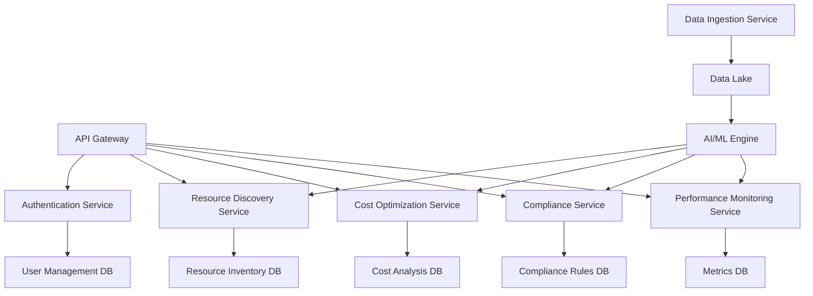

# Cloud Admin Agent: High-Level Design (HLD) Document

## 1. Introduction

This document provides a high-level technical overview of the Cloud Admin Agent platform, outlining the system architecture, main components, and key technical considerations.

## 2. System Architecture Overview

Cloud Admin Agent follows a microservices architecture deployed on a Kubernetes cluster. The system is designed to be cloud-agnostic and can be deployed on any major cloud provider or on-premises.

## 3. Main Components

### 3.1 API Gateway

- Handles all incoming requests
- Implements rate limiting and request validation
- Routes requests to appropriate microservices

### 3.2 Authentication Service

- Manages user authentication and authorization
- Implements OAuth 2.0 and OIDC protocols
- Integrates with enterprise SSO solutions

### 3.3 Resource Discovery Service

- Interfaces with various cloud providers' APIs
- Discovers and catalogs cloud resources
- Maintains up-to-date inventory of cloud assets

### 3.4 Cost Optimization Service

- Analyzes resource usage and spending patterns
- Generates cost-saving recommendations
- Implements approved cost optimization actions

### 3.5 Compliance Service

- Continuously checks resources against compliance rules
- Generates compliance reports
- Provides automated remediation options

### 3.6 Performance Monitoring Service

- Collects and analyzes performance metrics
- Detects anomalies and potential issues
- Provides real-time alerts and notifications

### 3.7 AI/ML Engine

- Processes large datasets to derive insights
- Trains and updates machine learning models
- Provides predictive analytics and intelligent recommendations

### 3.8 Data Ingestion Service

- Collects data from various sources (cloud providers, third-party tools)
- Normalizes and preprocesses data
- Stores data in the Data Lake for further processing

## 4. Data Flow

1. User interacts with the system through web UI or CLI
2. Requests are routed through the API Gateway
3. Authentication Service verifies user credentials and permissions
4. Appropriate microservice processes the request
5. AI/ML Engine provides intelligent insights and recommendations
6. Results are returned to the user through the API Gateway

## 5. Scalability Considerations

- Horizontal scaling of microservices using Kubernetes
- Use of cloud-native managed services for databases and message queues
- Implementation of caching layers for frequently accessed data
- Asynchronous processing for long-running tasks

## 6. Security Considerations

- End-to-end encryption for all data in transit
- Encryption at rest for all databases
- Regular security audits and penetration testing
- Strict access controls and principle of least privilege
- Secure handling of cloud provider credentials

## 7. Integration Points

- APIs for major cloud providers (AWS, Azure, Google Cloud)
- Webhook support for custom integrations
- Export APIs for BI tools integration
- SIEM integration for security event monitoring

## 8. Deployment Strategy

- Containerized deployment using Docker
- Orchestration with Kubernetes
- CI/CD pipeline using GitLab CI or GitHub Actions
- Blue-green deployment for zero-downtime updates

## 9. Monitoring and Logging

- Distributed tracing using Jaeger
- Centralized logging with ELK stack
- Prometheus for metrics collection
- Grafana for visualization and alerting

## 10. Disaster Recovery and Business Continuity

- Multi-region deployment for high availability
- Regular automated backups of all databases
- Disaster recovery plan with RPO < 1 hour and RTO < 4 hours

## 11. Future Enhancements

- Implementation of a service mesh (e.g., Istio) for advanced traffic management
- Adoption of serverless architecture for suitable components
- Integration of advanced AI capabilities (e.g., reinforcement learning for autonomous optimization)

## 12. Conclusion

This high-level design provides a scalable, secure, and flexible foundation for the Cloud Admin Agent platform. The microservices architecture allows for independent scaling and development of components, while the AI/ML engine enables intelligent and automated cloud management.
